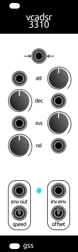

# vcadsr 3310
8HP Eurorack module

Voltage Contralled Envelope Generator

### Render
 

### Pots
Rregular ADSR behaviour

### Jacks
- **arrows**: gate input  
- **env out**: regular envelope
- **inv env**: inverse envelope

### Switches
- **speed**: `up` = fast, `down` = slow
- **offset**: `up` = inv env between -5V and 0V, `down` = inv env between 0V and 5V

## Footprints Libraries
Use provided submodule folder to link footprints locally in the project
- OS_Connectors
- OS_Scribbles
